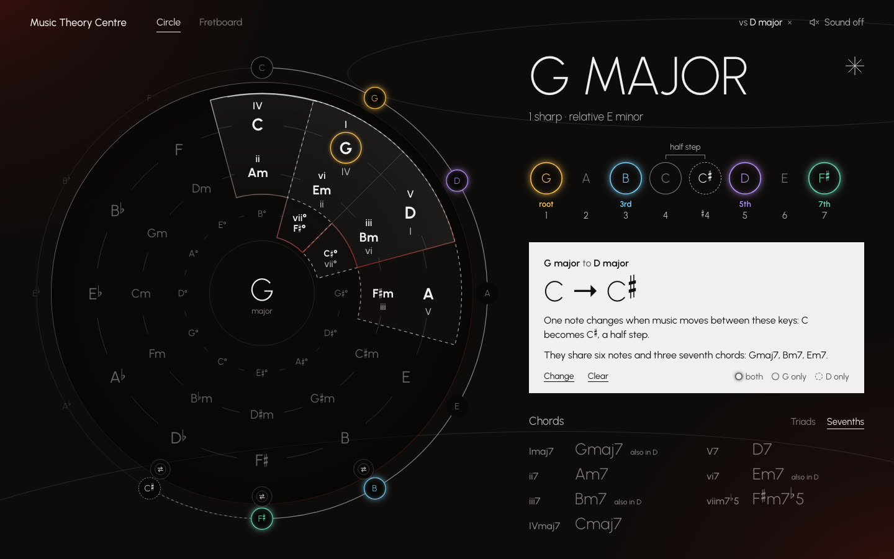
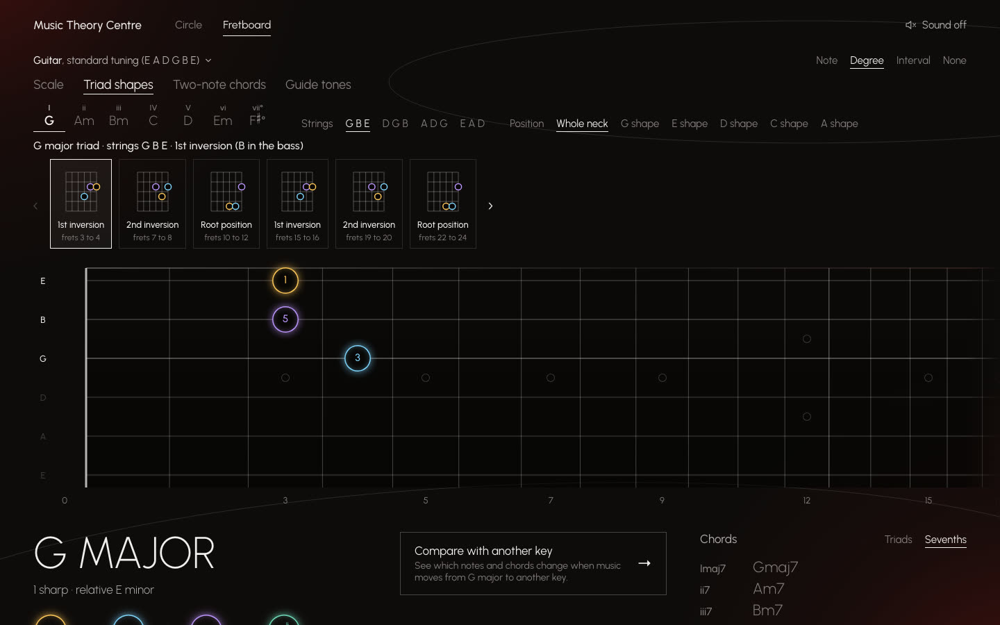

# Music Theory Centre

[](https://github.com/yyng04/music_grail/actions/workflows/deploy.yml)

A browser-based music theory visualiser that shows keys, chords and scales on a circle of fifths and a guitar or bass fretboard.

Live demo: <https://yyng04.github.io/music_grail/>





## Features

- A circle of fifths with the major keys, their relative minors and the diminished chords. The selected key's seven chords are marked with Roman numerals, and the key's notes are lit on an outer ring. Harmonic minor and the modes use their parent key's chords.
- Two keys can be compared. The app lists the notes that change between them (G major to D major: C becomes C♯) and the notes and chords they share.
- A fretboard for 6-string guitar and 4- and 5-string bass, in standard or drop D tuning, with up to 24 frets. It can be turned to the player's view or mirrored for the left hand, and it stands upright on phones.
- Each note is coloured by its role (root, 3rd, 5th or 7th) in the key or in a chosen chord, and labelled by note name, degree or interval.
- Shapes on the fretboard: the five CAGED positions, triads and their inversions on any three neighbouring strings, shell voicings (root, 3rd and 7th) in their four common forms, two-note chords, the key harmonised in 3rds, 6ths, 4ths or octaves, and the guide tones of one chord moving to the next.
- A line above the fretboard says whether the colours and numbers show roles in the key or in the chosen chord.
- A progression mode for practising between shell voicings: type chord symbols (any chords, in or out of the key), set how many bars each lasts, and the fretboard shows each chord's shell with hollow rings where the next chord's notes are, held notes marked. The shells are chosen so the hand moves as little as possible, or with the root on the 6th or 5th string.
- A metronome for the progression, from 40 to 240 BPM with tap tempo, in 2/4, 3/4, 4/4, 6/8 or 12/8, with one bar of count-in and the board changing on each chord's first beat. Instead of the click it can play sampled drums: rock, swing or bossa in 4/4, a jazz waltz in 3/4, or a 6/8 groove. The app never plays the chords themselves.
- Sampled guitar and bass sound, off by default. A note plays at its exact pitch, and a chord plays as an arpeggio and then together.
- Notes are spelled as the key spells them, so E♯ in F♯ major stays E♯. The URL records the key, the compare key, the chord, the fretboard view and the progression with its tempo, time and drums, so any view can be shared as a link.
- The keyboard reaches every control, and animation is turned off when the system asks for reduced motion.

## Stack

Vite, React and TypeScript, with Zustand for state, [Tonal](https://github.com/tonaljs/tonal) for the theory, [Tone.js](https://github.com/Tonejs/Tone.js) for sound and Motion for the circle's animation. The circle and the fretboard are hand-written SVG. Tests use Vitest and Playwright. The site is built by a GitHub Actions workflow and served from GitHub Pages.

## Running locally

Vite needs Node.js 20.19 or a later 20.x release, or Node.js 22.12 or later.

```bash
npm install
npm run dev
```

The app then runs at <http://localhost:5173/music_grail/>.

Other scripts:

- `npm test` runs the unit tests.
- `npm run e2e` builds the site and runs the Playwright tests.
- `npm run build` type-checks and builds the site into `dist/`.
- `npm run lint` and `npm run format:check` check the code style.

## Credits

- The guitar, bass and drum samples come from [Karoryfer Samples](https://www.karoryfer.com/) (Shinyguitar, Black And Blue Basses and Big Rusty Drums), released under CC0. [CREDITS.md](CREDITS.md) lists every file and its source.
- Music theory from [Tonal](https://github.com/tonaljs/tonal) (MIT).
- Sound from [Tone.js](https://github.com/Tonejs/Tone.js) (MIT).
- Fonts: [Urbanist](https://github.com/coreyhu/Urbanist) and [Noto Music](https://github.com/notofonts/music) (SIL Open Font License).
